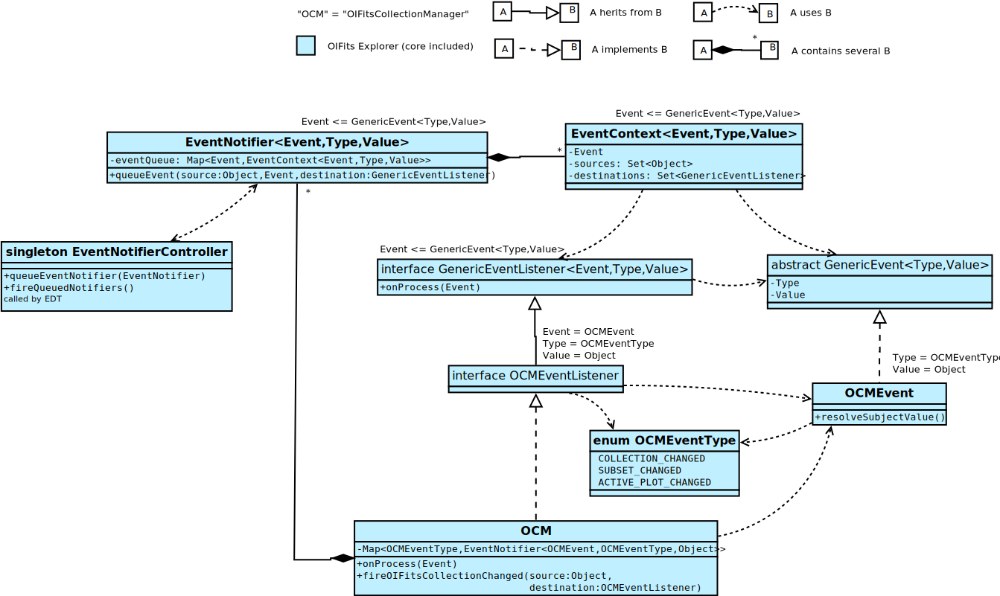

# Events in OIExplorer

The omnipresent lengthy name "OIFitsCollectionManager" will often be called "OCM".

## Overview

An Event in OIExplorer is represented by the `OCMEvent` class which implements the `GenericEvent` interface. An Event has a type, which is set to the enumeration `OCMEventType`, which values are the different possible types in OIExplorer, such as `COLLECTION_CHANGED`, `SUBSET_CHANGED`.. The Value of the Event is meant to contain details about where the event happened: for example with the event `SUBSET_CHANGED` it specifies the id of the changed subset. 

To fire an event, you use the class `OCM` with one of the methods `fireThisEvent()`. `OCM` possess a map of `EventNotifier` objects, one for each object type (i.e each value of `enum OCMEventType`). Consider an EventNotifier to be a storage for events waiting to be processed. Note that equal events are merged together. 

An event being stored in an `EventNotifier`, the `singleton EventNotifierController` uses the Swing utility `invokeLater` to process all stored events in a near future. Not processing them immediately leaves opportunity to store *and merge* more events.\
You should be careful about the asynchronous process of your event: your program state should be consistent *before* the event is processed. 

## Example sequence: add an OIFits file

- the users clicks on Load OIFits file button in the menu
- one click event is registered
- some things happens in the Swing Thread.. 
- the Swing Event queue process our click event
  - the handler function `LoadOIFitsAction.actionPerformed()` is called
    - it displays a mandatory dialog to the user so he can choose the OIFits file on the disk
    - it calls the function `OCM.loadOIFitsFiles()` to load the selected file
      - here I asbtract the fact that the actual loading of the file is an *asynchronous task*
      - it calls the function `OCM.addOIFitsFile(OIFitsFile)` to add the file into the collections
        - it analyzes the new OIFits file and adds it to the data structures
        - it calls the function `OCM.fireOIFitsCollectionChanged()` in order to ask the global analysis of the entire collections, and to trigger every program update that results from a change in the collection, for example it can change the data displayed in the plots
          - it gets from `OCM.ocmEventNotifiermap` the `EventNotifier` associated to the event `COLLECTION_CHANGED`
          - it calls `EventNotifier.queueEvent` with source `this` (i.e `OCM`) and destination `null` and a new `OCMEvent`
             - it adds the `Event` to `EventNotifier.eventQueue`. Equal Events are merged.
             - it completes the `EventContext` associated to the Event with the source and destination
             - it calls `EventNotifierController.queueEventNotifier` to register this notifier as "having events"
               - it adds the `EventNotifier` to the `queuedNotifiers`
		         - it registers itself to `SwingUtilities.invokeLater`
- some things happens in the Swing Thread...
- the Swing Thread calls `EventNotifierController.run`
  - it calls `fireQueuedNotifiers()`
    - foreach `EventNotifier` queued (including ours) it calls `EventNotifier.fireQueuedEvents`
	  - foreach `EventContext` (including ours) in `EventNotifier.eventQueue` it calls `EventNotifier.fireEvent()`
	    - it computes the Value of the `Event`, in our case simply a reference to `OIFitsCollection`.
       - foreach destination of the `EventContext`, it calls `GenericListener.onProcess`.
		   In our case destination is null, so it means every `GenericListener` declared to the `EventNotifier`.
         `OCM` has been declared as a listener of `COLLECTION_CHANGED` in its constructor.
         - `OCM.onProcess()` is called
		     - it analyses the collection, updates the subsets, the plots, etc.
		       This process itself fires some events, such as `SUBSET_CHANGED`.
		       Thus the event sequence will be followed again, until no new event is fired.

